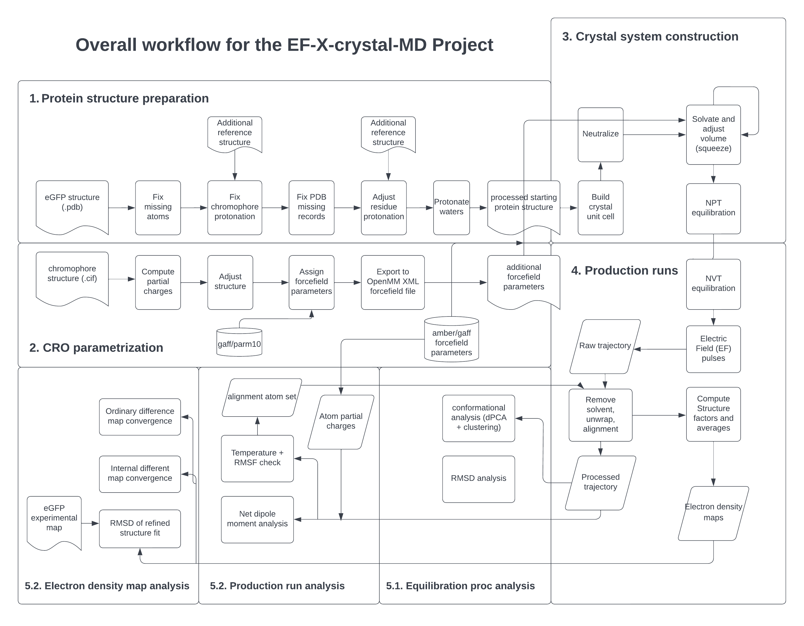

# EF-X-Crystal-MD

## Overview
The enhanced green fluorescent protein (eGFP) is an excellent model system for studying the dynamics of electric charge distribution and its dependence on the local chemical environment. Our lab has collected time-lapsed X-ray diffraction (XRD) and spectroscopy data for eGFP under standard conditions or pumped by a terahertz (THz) waveform. The immediate aim of the current project is to corroborate the electron density maps and the difference maps produced from molecular dynamics (MD) simulations with the experimental data, and to understand how strong electric fields can be used to probe eGFP protein structure.

## Background
Broadly used in biosciences, eGFP is a constitutively fluorescent protein whose photophysical properties have been extensively studied via various methods. Upon absorption of blue light, the chromophore is promoted to the excited state with a redistributed local electron density. Its conformation and the kinetics of different relaxation pathways back to the ground state is strictly regulated by the interaction with side chains on the neighboring residues. Hence, eGFP is an excellent model system for illustrating the protein structure-function relationship .  

Working with a human PDZ domain, Hekstra et al. has first shown that by combining the application of strong electric field pulses to protein crystals and time-lapsed X-ray crystallography, we can observe protein conformational changes with high spatial and temporal resolution. By controlling the electric fields, which exert forces on charged amino acids within proteins, we can transiently perturb the protein molecules within crystals. By adjusting the delay between the X-ray and THz pulses, we can image the response of the protein crystals, such as the concerted motions of amino acid residues, to the electric field perturbation in real time. The advent of the powerful X-ray free electron lasers (XFELs) and THz lasers with strong electric field components has allowed us to pump and probe eGFP with even shorter and more intense pulses, further expanding the range of biochemically relevant protein mechanics that we can now study.

On the other hand, in silico atomistic modeling methods such as MD simulations could theoretically be used to directly study the kind of protein dynamics that interest us. However, its accuracy highly depends on the parametrization of the molecular system, e.g., protonation states and force fields and also how the simulation runs are performed and analyzed. Eventually, to ensure that our EFX method can provide insights to questions about protein mechanics, it’s desirable that we can corroborate the time-lapsed XRD data with results obtained from MD simulations.

In the current project, I implemented and partially validated an end-to-end workflow to compute electron density and density different maps that are comparable to the experimentally obtained maps, starting from only the lab-determined structure for eGFP. Combined with my earlier project with the PDZ domain, this procedure is readily applicable to protein crystal supercells of arbitrary size and space group. Moreover, pulse frequency, waveform, and electric field magnitude could all be tweaked, potentially allowing us to test experiment designs beyond what can be achieved with current apparatuses. 

## Repo Organization
This repository contains a series of notebooks that demonstrates the entire workflow from preparing the protein structure and parametrizing the forcefield to actually running the simulations and conducting several basic analyses. In each of the five folders there will be at least one jupyter notebook accompanied by the scripts and/or data for the particular step. In each notebook I strive to write a clear introduction to give some background and motivation about the particular steps in the entire workflow, then there will be multiple sections with codeblocks and embedded figures, tables, or code output that demonstrates the expected result by following the workflow. By organizing this repo I have rewritten some of my scripts and strived to automate as much as possible and ensure the reproducibility of the results. 

The following diagram shows the entire workflow for this project:

## Processed Dataset
In the production run step five independent replicate simulations of the eGFP crystal system were conducted. The raw trajectories were too large and thus not shared. But the [processed dataset](https://figshare.com/articles/dataset/EF-X_crystal_MD_EGFP_calculated_electron_density_maps/21737069) containing averaged electron density map, ordinary difference map, and internal difference map computed from the raw data was deposited on FigShare. One should be able to use the scripts provided in this repo to produce the processed dataset for a different set of simulaiton replicates. Please refer to the dataset description on FigShare for more details about the content and naming convention of the data files. To use the dataset, please download and unzip the `processed_data` folder to the `Analyses` folder and refer to the notebook in it for more instruction.

## Requirements
Admittedly this is a major headache since we have utilized many tools across the fields of molecular simulation, modeling, and structure refinement. Please see the `environment.yml` file for a list of packages and build versions used for this project. For compatibility the `--no-builds` flag was used to remove build specification but we did not use `--from-history` flag as some packages are installed by pip. Our environment should be compatible with Python 3.7.12 and 3.9.15. To use the YAML file to install dependencies for this project via Conda, run the following command:

`conda env create -f environment.yml`

Please consider open an issue if you could not initialize a new Conda environment from this YAML file or found that it's missing some packages.

Aside from the Conda environment, there are at least a few more hoops to jump through:

1. AmberTools 21/22: This could be installed with conda now, but please check you can call `antechamber` from command line, if not, please check the [Installation FAQ](https://ambermd.org/Installation.php) to debug. Also, please set your AMBERHOME environment variable in the shell to point to your Conda installation if the LEaP program cannot load its library files.

2. OpenMM 7.7: The latest release as of now is 8.0, we haven't tested but hopefully the code should be working. Please ensure you install [OpenMM with GPU support](http://docs.openmm.org/latest/userguide/application/01_getting_started.html#installing-openmm) according to their manual, for otherwise the MD simulation production runs will be very slow.

3. Phenix: This is a comprehensive software suite for macromolecular structure determination, and we are just using the `phenix.fmodel`, `phenix.get_cc_mtz_mtz` from the entire suite. Please follow [their instruction](https://phenix-online.org/documentation/install-setup-run.html) to install, or alternatively use the build that's provided on your HPC by modifying the path to the `bin` folder in my scripts.

4. Coot: It is a molecular model-building and visualization program that has native support for `.mtz` files that store reflection data and also our computed electron density map, and we use Coot in our final step. Please follow either the [official doc](https://www2.mrc-lmb.cam.ac.uk/personal/pemsley/coot/) to install. Mac OSX users could also follow the instruction [here](https://scottlab.ucsc.edu/xtal/wiki/index.php/Stand-Alone_Coot) to install Coot with homebrew.

5. mdtools: A set of tools developed by former lab member Jack Greisman for running MD simulations using OpenMM. I have heavily modified the `squeeze.py` script and added util functions that are used throughout multiple notebooks, so please install from my fork [here](https://github.com/ziyuanzhao2000/mdtools) to avoid breaking a lot of code.

## Running the code
Unless you see the starting files are available in the notebook folders, you will generally have to run them in sequential order (refer to the flow diagram) to produce the correct outputs first for use in the next step. Also, although the first two notebooks for CRO parametrization and protein preparation are perfectly good to be run on a local machine, you will probably want to run the code from the last three notebooks on a HPC and make use of the python and shell scripts to save some time and manual work. Please refer to the notebooks for more details.

## Miscellaneous
Please send any questions you might have about the code or data to ziyuanzhao@college.harvard.edu.

